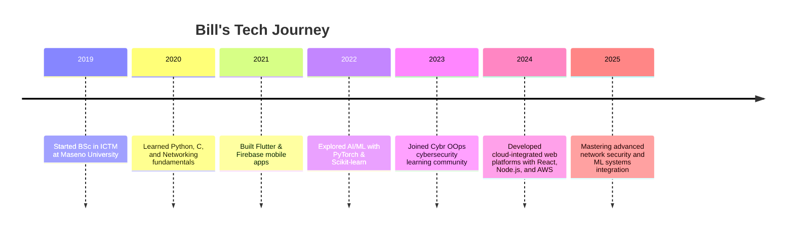

<!-- 🌟 GITHUB PROFILE README FOR BILL GRAHAM PEACEMAKER 🌟 -->

  
  
  <h1 style="color:#E0F7FA;">Hey Techies! 👋, I'm Bill Graham Peacemaker from Nairobi, Kenya.</h1>
  
💻 Computer Programmer | 🌐 Network Engineer | 🧠 Machine Learning Enthusiast

  
  

    📧 <a href="mailto:grahambill011@gmail.com" style="color:#FFD700;">grahambill011@gmail.com</a>  
    &nbsp; | &nbsp; 📱 <a href="tel:+254790613916" style="color:#FFD700;">+254 790 613 916</a>
  

---

## 🧭 About Me

🚀 Passionate about solving real-world problems through **innovative tech solutions**.  
💡 Skilled in both **software and network engineering**, combining creative thinking with technical precision.  
🌍 Based in Nairobi, Kenya — building cross-platform applications that make an impact.  
📘 Constantly learning, experimenting, and sharing knowledge with the community.  

---

  <kbd>
    
  </kbd>

---

## 💪 Skills

| Category | Skills |
|-----------|---------|
| **Machine/Deep Learning** |       |
| **Languages** |     |
| **Mobile Development** |    |
| **Web Development** |       |
| **Database & Tools** |     |

---

## 🚀 My Journey Timeline  

---

## 🎓 Education & Certifications  

### 🎓 Academic Background  
🎯 **Bachelor of Science in Information and Communication Technology Management**  
📍 *Maseno University, Kenya*  
🗓️ *2019 – 2024 (Ongoing)*  

---

### 🏅 Professional Certifications  

---

💼 **Core Knowledge Areas:**  
- Network Configuration & Troubleshooting (Cisco)  
- System Security & Endpoint Protection (Sophos)  
- Python Automation & Scripting  
- Cloud Infrastructure (AWS)  
- Cyber Threat Analysis & Defense (Cybr OOps)  
- Hardware, Operating Systems & IT Support (IT Essentials)

---

🧠 *“Knowledge without practice is like code without execution.”*  

---

## 📜 Awards & Achievements  

🏆 **Top Student in Computer Networks** — Maseno University (2022)  
🚀 **Finalist**, National Cybersecurity Challenge Kenya (2023)  
💡 **Built “Smart Water Portal”** — a Flutter + Firebase IoT app for Nawassco (2024)  
🌍 **Contributor**, Open Source AI/ML Projects (2024–2025)

---

## 📊 GitHub Stats  

  

---

## 🐍 Contribution Graph  

  

---

## 🔗 Connect with Me  

---

⭐ **“Keep building, keep learning, keep impacting.”**
